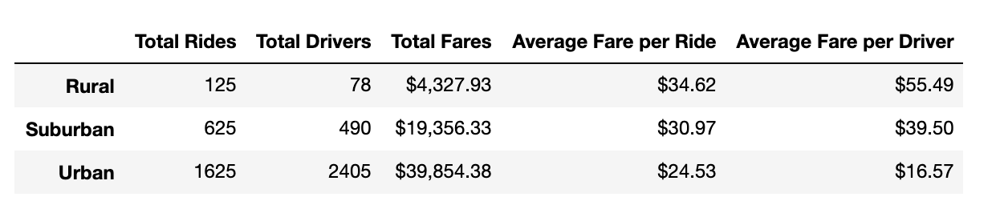
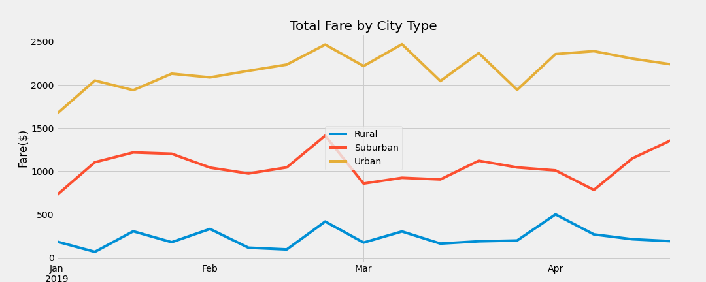

# PyBer_Analysis
Analyzing ride share data &amp; providing data visualizations using Matplotbib, Matlab & Pandas. 

## Overview of the analysis:
This analysis dives into ride share data to compare trends between urban, suburban and rural rides. The goal of this analysis is to help improve access to ridesharing services and determine affordability for underserved neighborhoods. 

## Results:
#### PyBer Summary 

Through this analysis we can see that we have the highest number of rides & drivers in urban areas. This shouldn't be surprising, given in urban areas tend to be more dense. On the other hand, average fare per ride & per driver is the highest in rural areas. The less dense a region tends to be, the more costly the ride share service becomes. This could be because there is less demand, and less drivers available in these areas, as shown in the Total Rides and Total Drivers results. 

#### Total Fare by City Type

This is a line chart comparing the total fares on a weekly basis between each city type for Jan-April in 2019. Urban rides generate the highest total fares even though they typically charge the least per ride. 

#### PyBer Ride Sharing Data 

Using this bubble chart, we can see that there is a negative correlation between number of rides and price. That means, as the number of rides per city increases, the price generally decreases. 

### Summary:

Through the PyBer Summary and Total Fare by City Type chart, we can see that charging higher per ride does not mean a city type will generate the most money. There are a few approaches that can be taken in order to increase popularity in Pyber Ride Share outside of just urban areas. 

1. Increase the number of drivers available: Increasing the drivers can impact the riders in a few ways. Although this data is not provided, less drivers in an area can amount to a longer wait time for the rider. This is not ideal and may be a reason why less drivers in rural, or suburban area turn to PyBer. Additionally, more drivers can drive down the cost/ride, making PyBer more appealing to potential riders. 

2. Reduce the cost of rides in rural & suburban areas: Another approach to increasing the number of rides within a city type, could be reducing the cost of rides in rural and suburban cities. Decreasing the cost may lead to an increase in count of rides. The more rides within a city, can lead to a growth in number of drivers. 

3. Begin diving into trends around wait & drive time:Another variable that could have an impact on why ride count is lower in rural & suburban areas could be trends around rider wait times & drive times. These are not metrics we are currently looking at. Rider wait time can either be related to the number of drivers available in their area, or the distance drivers typically have to travel between riders. This can provide more insight on areas that can be improved for rider cost and accessibility. 

